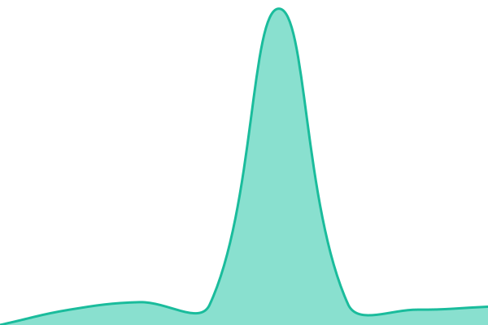

# [UpSensei Status](https://status.upsensei.eu/)

Live uptime and response-time history for [UpSensei](https://upsensei.eu), updated automatically every 5 minutes. Powered by [Upptime](https://upptime.js.org).

This repository contains the open-source uptime monitor and status page for [UpSensei](https://status.upsensei.eu/), powered by [Upptime](https://github.com/upptime/upptime).

With [Upptime](https://upptime.js.org), you can get your own unlimited and free uptime monitor and status page, powered entirely by a GitHub repository. We use [Issues](https://github.com/UpSensei/upsensei-status/issues) as incident reports, [Actions](https://github.com/UpSensei/upsensei-status/actions) as uptime monitors, and [Pages](https://status.upsensei.eu/) for the status page.

<!--start: status pages-->
<!-- This summary is generated by Upptime (https://github.com/upptime/upptime) -->
<!-- Do not edit this manually, your changes will be overwritten -->
<!-- prettier-ignore -->
| URL | Status | History | Response Time | Uptime |
| --- | ------ | ------- | ------------- | ------ |
|  [UpSensei App](https://upsensei.eu) | 🟩 Up | [up-sensei-app.yml](https://github.com/UpSensei/upsensei-status/commits/HEAD/history/up-sensei-app.yml) | 

 10655ms
     
 | 

<a href="https://status.upsensei.eu/history/up-sensei-app">100.00%</a>
    

|  [UpSensei Auth](https://auth.upsensei.eu/.well-known/jwks.json) | 🟩 Up | [up-sensei-auth.yml](https://github.com/UpSensei/upsensei-status/commits/HEAD/history/up-sensei-auth.yml) | 

 929ms
     
 | 

<a href="https://status.upsensei.eu/history/up-sensei-auth">100.00%</a>
    

<!--end: status pages-->

[**Visit our status website →**](https://status.upsensei.eu/)

## 📄 License

- Powered by: [Upptime](https://github.com/upptime/upptime)
- Code: [MIT](./LICENSE) © [Anand Chowdhary](https://anandchowdhary.com)
- Data in the `./history` directory: [Open Database License](https://opendatacommons.org/licenses/odbl/1-0/)
